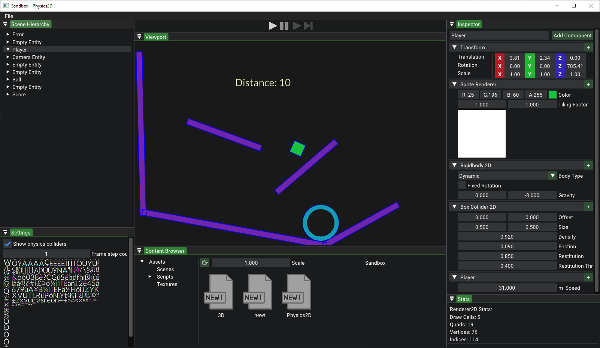
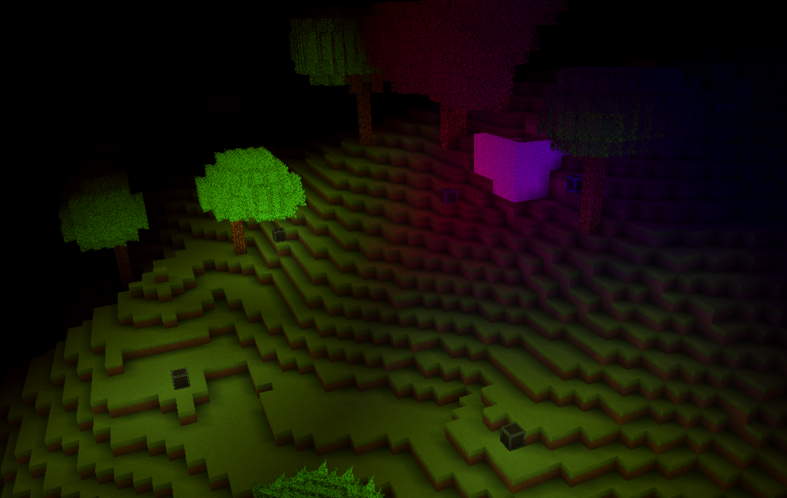

# Project Portfolio
This portfolio covers two deeply interrelated projects: a custom 3D game engine written in C++, and a multiplayer voxel RPG built on top of it. Both have been in active development since 2018.

---

# Custom Game Engine
The engine is approximately 20,000 lines of C++ and is built for modularity and cross-platform compatibility. Its renderer is fully agnostic to the underlying graphics API and a Vulkan backend is currently in progress alongside the existing OpenGL implementation. The asset pipeline handles diverse resource types with configurable import and load settings, automatically converting raw files into optimized engine-ready formats. C# scripting is integrated via Mono, exposing engine APIs for rapid prototyping in a workflow built entirely from scratch. A custom Premake-based build system keeps the project organized and scalable across configurations. Current development targets audio support, skeletal animation, and a dedicated UI framework.

---

# Multiplayer Voxel RPG
The game features a 3D procedurally generated voxel world that is constructed on the fly and fully editable in real time. Its multiplayer architecture is built on a UDP transport layer with a fully authoritative server model: clients transmit only inputs, making cheating architecturally impossible without invasive anticheat. Responsive gameplay under adverse network conditions is achieved through client-side prediction with server reconciliation and rollback on misprediction, lag compensation, and delta-compressed custom-serialized state synchronization. A framerate and tickrate decoupling system allows clients to render at arbitrary framerates while still benefiting from sub-tick interpolation independently of the server tick rate. The game's systems are designed with modding as a first-class concern, drawing on research into established mod ecosystems to ensure extensibility from the ground up.

